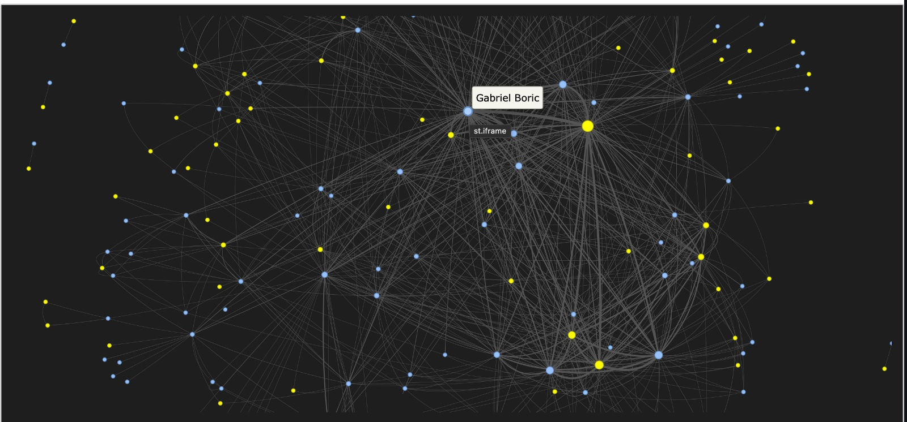

## Mapping Connections in Chilean News

This project is a graph analysis tool that visualizes relationships between political figures, organizations, and institutions in Chile based on public news articles.



## Motivation

I built this project because I was intrigued by the investigative work behind the Panama Papers (ICIJ). Reading about that investigation, I learned that they didn't just read millions of documents; they treated them as a network. They used graph databases to map how politicians, shell companies, and lawyers were connected.

I wanted to understand how that technology works on a practical level. My goal was to replicate that logic on a smaller scale using Chilean news (Emol) to answer a simple question: **If we treat the news as a dataset, who is really connected to whom?**

This project takes unstructured text (daily news) and converts it into a structured network, allowing us to see clusters of influence that aren't obvious when reading a single article.

## How It Works

The project runs in three distinct stages:

1. **Data Collection:** I wrote a script to navigate the site maps of Emol.com and download recent articles. I focused on the text content while filtering out noise like ads and video captions.
2. **Entity Extraction:** Using Natural Language Processing (spaCy), the system scans every article to identify "Entities" (People and Organizations).
3. **Network Construction:** If two entities appear in the same article, the system assumes a relationship. The more often they appear together, the stronger the connection (weight) becomes.
4. **Visualization:** The final output is an interactive web dashboard where nodes are sized by their centrality (importance in the network) and grouped by their connections.

## Project Structure

- `src/scraper.py`: Handles the web scraping logic. It respects server limits and cleans the raw HTML.
- `src/processor.py`: The core logic. It loads the language model, extracts entities, applies normalization rules, and builds the edge list.
- `src/app.py`: A Streamlit dashboard that renders the graph using PyVis.
- `src/config.py`: Contains the configuration settings, including the entity mapping dictionary and stop-words.

## Tech Stack

- **Python 3.10+**
- **spaCy:** For Named Entity Recognition (Spanish large model).
- **BeautifulSoup4:** For parsing HTML.
- **NetworkX & PyVis:** For calculating graph metrics and rendering the visualization.
- **Streamlit:** For the web interface.

## How to Run

1. **Clone the repository**

```bash
git clone https://github.com/kmoragap/emol-graph-project.git
cd emol-graph-project

```

2. **Install dependencies**

```bash
pip install -r requirements.txt
python -m spacy download es_core_news_lg

```

3. **Run the pipeline**
   This project is modular. You must run the data collection and processing before launching the app.

```bash
# 1. Download the news
python src/scraper.py

# 2. Process the text and build the graph
python src/processor.py

# 3. Launch the visualization
streamlit run src/app.py

```

## Note on Google Colab

If you are running this in Google Colab, you will need to use a tunneling service (like localtunnel) to view the Streamlit dashboard, as Colab runs on a remote server. The code in `src/app.py` is optimized to generate inline resources to support this.
